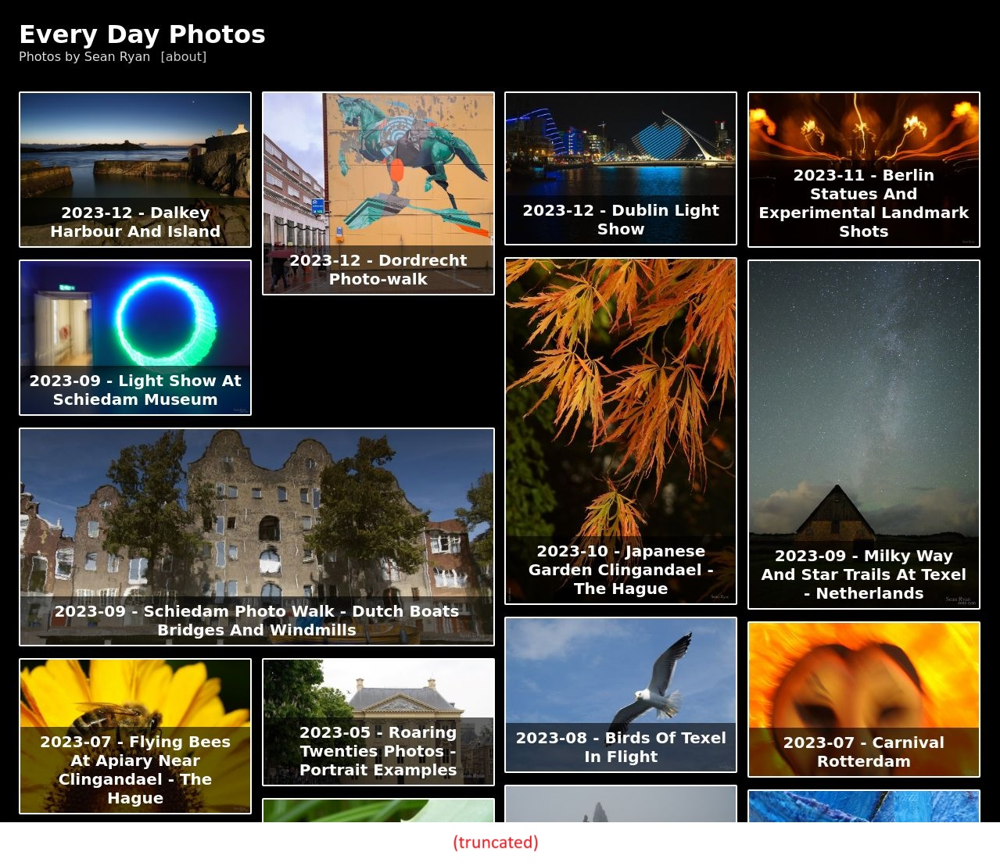

# style-scraper
Scrape styles from a website using reliable computed styling via a headless browser [fonts, colors, border styles ...]

- programatically inspect elements of the website, without a visible browser
- extract correct *actual* computed styles for elements on the webpage
- elements found by co-ordinates (offset from top-left of page)
- screenshot of the full vertical length of the webpage (automatic scrolling)

## Example execution

COMMAND:

```
./go.sh https://everydayphotos.net 180 300
```

OUTPUT:

```
> style-scraper@1.0.0 start
> node src/scrape-via-puppeteer/index.js https://everydayphotos.net 180 300

Saving screenshot to: ./temp/screenshot.jpg
Get element by co-ordinates (180, 300)
A
HTML > IMG > BODY > DIV > DIV > DIV > A
{
  backgroundColors: [ 'rgba(0, 0, 0, 0.6)', 'rgb(0, 0, 0)' ],
  borderColors: [ 'rgb(255, 255, 255)', 'rgb(0, 0, 238)' ],
  colors: [ 'rgb(255, 255, 255)', 'rgb(0, 0, 238)' ],
  fontFamilies: [
    'Frutiger, "Frutiger Linotype", Univers, Calibri, "Gill Sans", "Gill Sans MT", "Myriad Pro", Myriad, "DejaVu Sans Condensed", "Liberation Sans", "Nimbus Sans L", Tahoma, Geneva, "Helvetica Neue", Helvetica, Arial, sans-serif'
  ],
  fontSizes: [ '20px' ]
}
```

SCREENSHOT (cropped):



- the screenshot includes the full vertical length of the website, by automatically scrolling

## Setup

### Pre-requisites

- OS: Ubuntu

- nodejs
  - node version 18

```
curl https://raw.githubusercontent.com/creationix/nvm/master/install.sh | bash 
source ~/.bashrc
source ~/.profile

nvm install 18
nvm use 18

node --version
```

- C++ libraries

```
sudo apt-get update
sudo apt-get install -yq --no-install-recommends libasound2 libatk1.0-0 libc6 libcairo2 libcups2 libdbus-1-3 libexpat1 libfontconfig1 libgcc1 libgconf-2-4 libgdk-pixbuf2.0-0 libglib2.0-0 libgtk-3-0 libnspr4 libpango-1.0-0 libpangocairo-1.0-0 libstdc++6 libx11-6 libx11-xcb1 libxcb1 libxcursor1 libxdamage1 libxext6 libxfixes3 libxi6 libxrandr2 libxrender1 libxss1 libxtst6 libnss3
```

### Install

```
chmod +x ./install.sh
./install.sh
```

```
npm test
```

## Usage

```
./go.sh <URL to website> <x> <y>
```

- where x and y are the co-ordinates at which to inspect the webpage for style details.

## Trouble-shooting

1. Error on Ubuntu: "error while loading shared libraries: libgbm.so.1: cannot open shared object file: Puppeteer in Nodejs on AWS EC2 instance"
    - solution: `sudo apt-get install -y libgbm-dev`

## References

- https://pptr.dev/
- https://www.toptal.com/puppeteer/headless-browser-puppeteer-tutorial
